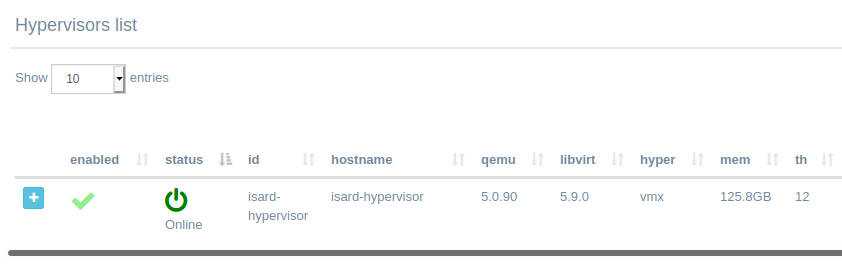

<h1>Admin FAQs & Troubleshooting</h1>

[TOC]

# Installation

## After finishing install the default isard-hypervisor is disabled or shows error

If you open de hypervisor details (click on + button) you will see messages from IsardVDI engine that can be useful to determine what happened. If you just finished install wizard and isard-hypervisor is disabled probably the problem is with virtualization capabilites. You should check de **hyp** field and it should show some virtualitzation capability (vms or svm). 



If it shows *False* then you should check your host virtualization as follows.

Your hardware needs to have virtualization enabled. You can check that in your BIOS but also from CLI:

```bash
egrep ‘(vmx|svm)’ /proc/cpuinfo
```

If you see nothing in the output your CPU has no virtualization capabilites or they are disabled in BIOS. Please verify that your CPU has that capability and that it is not disabled in BIOS.

You may also check for that capability inside de isard hypervisor running container by issuing the command:

```bash
sudo docker exec -it isard-hypervisor virsh capabilities |grep "feature name"
```

# Viewers

## Tries to connect to localhost or incorrect IP/hostname

Disable isard-hypervisor in Hypervisors menu and check that viewer hostname is correct:

1. Disable isard-hypervisor in Hypervisor menu
2. Edit Hypervisor (details edit button)
3. Check/Update **Client viewers address**. Should be the hostname/IP where IsardVDI is running and must be accessible from clients.
4. Enable isard-hypervisor again and start new domain to check viewer connection.

### Explanation

Probably you did the wizard using 'localhost' or an IP address different to the one you are trying to connect now with viewers. That lead to an isard-hypervisor set up with 'localhost' or that wrong server IP address.

You can always modify the viewer address used for clients editing the isard-hypervisor. To edit it you must first disable isard-hypervisor by clicking in Enable/disable button:


 and then the edit button will be enabled so you can access the isard-hypervisor edit form:


There are three viewer IPs fields that can be set:

- **Web host**: This IP/dns will be the one used in HTML5 viewers from your network connecting to your IsardVDI server. So it should be set up to the real IP address of your web server. 
- **Video proxy host**: This should be the same IP/DNS as *web host* if you have an 'all-in-one' installation. If this is a remote hypervisor it should be the IP/DNS reachable from outside world for that hypervisor.
- **Hypervisor hostname from video proxy**: As this is used in complex infrastructures just set there **isard-hypervisor** that is the default name for hypervisor container.

Enable the hypervisor again. 

NOTE: *When enabling and disabling hypervisors it is recommended to restart isard-engine container as this process is not completely reliable now and could fail. To restart it do:*

```bash
sudo docker-compose restart isard-engine
```

This does not affect to currently started virtual machines.

# Updates

## Which user and password do the downloaded domains have?

All domains that can be downloaded from updates have by default the user **isard** and the password **pirineus**. The isard user has also superuser privileges.

# Certificates

## Can't access Isard after replacing certificates

The new certificate will be used to access your IsardVDI webserver now. Verify that it is using it in your browser (usually there will be a locker icon before url input).

- In case it is not using new certificate check isard-portal  container logs while bringing it up with docker-compose up (withouth daemonizing it with -d). There you will see information about the cert found in folder. 
- Check the certificates now in default folder **/opt/isard/certs/default**. Code should have generated a chain.pem and video.pem.  Follow the [certificate set up](../install/certificates.md) section.

In case your new certificates didn't work it is recommended to remove all the certificates, bring IsardVDI up again so it will create new self-signed ones, and start the process of replacing certificates again (first brind down IsardVDI).

## Which viewer connections are encrypted?

Certificate info will be shown at menu Hypervisors -> Default pool, showing that it is in **Secure** mode and the **domain info** taken from the updated cert. 

All viewer connection are secured with ssl certificates, either self-signed or letsencrypt (if you configured to generate it by default) or any commercial certificate you set up followin the [certificate set up](../install/certificates.md) section 
