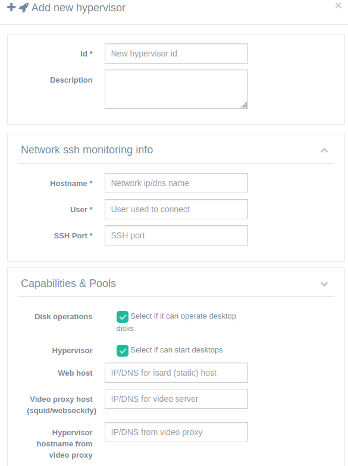

<h1>Hypervisors</h1>

[TOC]

# Types of hypervisors

## Pure hypervisor

When you edit or create an hypervisor you can check if it will be only an hypervisor. In this mode that server will only be used by IsardVDI to run virtual desktops. No virtual disks operations will be handled by this server.

## Pure disk operations

In this mode the server will only be used to handle virtual desktops disk operations.

## Mixed hypervisor + disk operations

This mode will use the server for both running virtual desktops and executing virtual disk operations.

# External hypervisors

The preferred method for setting up a new hypervisor is to use the docker isard-generic-hyper image as it will bring up all the services needed in any linux host with docker. Three steps are required:

1. Install KVM hypervisor (docker recommended)
2. Add ssh keys for new KVM hypervisor
3. Create new hypervisor in IsardVDI web UI.

## Install KVM hypervisor

### Docker Install (preferred)

Quick and easy setup of an external hypervisor could be done by using the **./build.sh hypervisor**  hypervisor.yml generated compose file. In your clean Linux installed server that will be the KVM hypervisor start container:

```
./build.sh hypervisor
docker-compose -f hypervisor.yml up -d
```

Remember to configure isardvdi.conf file prior to building hypervisor.yml file. Mainly you can set up there your video letsencrypt domain (if not it will use autogenerated certificate). That should bring up a complete Isard Hypervisor in your server. 

If you are not setting a letsencrypt configuration in isardvdi.conf file then you need to set up the same viewers certificates in all hypervisors. In this case you should copy /opt/isard/certs/viewers/* certificate files from web host to the same folder in your remote hypervisors (removing the ones already there) and bring hypervisor docker up again.

Run this command to reset ssh keys and password:

```bash
docker exec -e PASSWORD=<YOUR_ROOT_PASSWORD> isard-hypervisor bash -c '/reset-hyper.sh'
```

After that you can continue to add ssh keys for this hyper in your IsardVDI isard-engine container and create new hypervisor in UI:

```bash
docker exec -e HYPERVISOR=<IP|DNS> -e PASSWORD=<YOUR_ROOT_PASSWD> -e PORT=2022 isard-engine bash -c '/add-hypervisor.sh'; history -d $((HISTCMD-1))
```

### Manual Install

If you want to use another host as the KVM hypervisor ensure it has:

- **libvirtd**:
  - * **service running**: ```systemctl status libvirtd```. Check with your distro how to install a complete KVM hypervisor:

      * https://wiki.debian.org/KVM#Installation
      * https://help.ubuntu.com/community/KVM/Installation
      * https://wiki.centos.org/HowTos/KVM
      * https://wiki.alpinelinux.org/wiki/KVM

    * **certificates enabled**: Actual certificates on IsardVDI path ```/opt/isard/certs/default/``` must be copied to your new KVM server path ```/etc/pki/libvirt-spice```. Also some lines should be added to *libvirtd.conf* and *qemu.conf* to make use of the certificates:

      * ```bash
        echo "listen_tls = 0" >> /etc/libvirt/libvirtd.conf; 
        echo 'listen_tcp = 1' >> /etc/libvirt/libvirtd.conf;
        echo 'spice_listen = "0.0.0.0"' >> /etc/libvirt/qemu.conf
        echo 'spice_tls = 1' >> /etc/libvirt/qemu.conf
        ```

    * **websocket server**: In order to allow connection to viewers through browsers also a websocket server should be set up. You should look at the *start_proxy.py* included dockers/hypervisor.
- **sshd service running and reacheable for user**: ```systemctl status sshd```
- **curl**: It will be used to get updates. 
- **qemu-kvm**: You should create link to your qemu-system-x86_64 like this ```ln -s /usr/bin/qemu-system-x86_64 /usr/bin/qemu-kvm```

## Add ssh keys for new Hypervisor 

You should previously add ssh keys to access that hypervisor. We do provide an script inside isard-app container to do this:

```bash
docker exec -e HYPERVISOR=<IP|DNS> -e PASSWORD=<YOUR_ROOT_PASSWD> isard-engine bash -c '/add-hypervisor.sh'
```

**Note**: There are optional parameters that can be set:

- PORT: Default is *22*
- USER: Default is *root*

After doing this you should go to hypervisors menu and add a new hypervisor with the same IP/DNS. Engine will try to connect when you enable that hypervisor.

**Example:**

Note that whe added ``; history -d $((HISTCMD-1))`` to the command to avoid password being kept in our history.

```bash
root@server:~/isard# docker exec -e HYPERVISOR=192.168.0.114 -e PASSWORD=supersecret isard_isard-app_1 bash -c '/add-hypervisor.sh'; history -d $((HISTCMD-1))
fetch http://dl-cdn.alpinelinux.org/alpine/v3.8/main/x86_64/APKINDEX.tar.gz
fetch http://dl-cdn.alpinelinux.org/alpine/v3.8/community/x86_64/APKINDEX.tar.gz
fetch http://dl-cdn.alpinelinux.org/alpine/edge/testing/x86_64/APKINDEX.tar.gz
(1/1) Installing sshpass (1.06-r0)
Executing busybox-1.28.4-r2.trigger
OK: 235 MiB in 127 packages
Trying to ssh into 192.168.0.114...
# 192.168.0.114:22 SSH-2.0-OpenSSH_7.6p1 Ubuntu-4ubuntu0.1
# 192.168.0.114:22 SSH-2.0-OpenSSH_7.6p1 Ubuntu-4ubuntu0.1
# 192.168.0.114:22 SSH-2.0-OpenSSH_7.6p1 Ubuntu-4ubuntu0.1
/usr/bin/ssh-copy-id: INFO: Source of key(s) to be installed: "/root/.ssh/id_rsa.pub"
/usr/bin/ssh-copy-id: INFO: attempting to log in with the new key(s), to filter out any that are already installed
expr: warning: '^ERROR: ': using '^' as the first character
of a basic regular expression is not portable; it is ignored

/usr/bin/ssh-copy-id: WARNING: All keys were skipped because they already exist on the remote system.
		(if you think this is a mistake, you may want to use -f option)

Hypervisor ssh access granted.
Access to 192.168.0.114 granted and found libvirtd service running.
Now you can create this hypervisor in IsardVDI web interface.
```

If it fails, disable hypervisor, edit parameters and enable it again. IsardVDI engine will check connection again. You can see failed message in hypervisor details (click on + button to see details).

If engine is not trying to connect again after enabling new hypervisor follow to restart isard-app container:

```bash
docker restart isard_isard-app_1
```

**NOTE**: Probably you want to remove default isard-hypervisor after creating a new external hypervisor. Disable isard-hypervisor and delete from hypervisor details. A *Force delete* action and isard-app container restart may be done afterwards.

## Add hypervisor in web UI

You can add external hypevisor in web UI as admin user. You can set up anything in ID field to identify this hypervisor but take care with other configuration fields as must match remote hypervisor:



Hostname should be the IP/DNS reacheable from this IsardVDI installation. It could be an internal network between both hosts. The user will be *root* and ssh port **2022** as we left default ssh port 22 for ssh access to the host.

Recommended to activate *disk operations* and *hypervisor* options and set web host to this web installation IP/DNS host and video proxy to the IP/DNS externally reacheable for the hypervisor (access to their viewers through ports 80 and 443). Set hypervisor hostname from video proxy to isard-hypervisor as it is the container name for hypervisor defaults.

# VLANS in hypervisor

To connect a trunk interface with vlan definitions inside the hypervisor you have to set (and uncomment) variables in your isardvdi.cfg:

**IMPORTANT NOTE**: Remember to rebuild the docker-compose by issuing the ./build.sh command again.

- **HYPERVISOR_HOST_TRUNK_INTERFACE:** This is the host network trunk interface name as seen in the host. For example: eth1

  If you don't set HYPERVISOR_STATIC_VLANS the hypervisor will auto detect vlans for 260 seconds each time it starts isard-hypervisor container. So, it is better to define the static vlans you know are in the trunk.

- **HYPERVISOR_STATIC_VLANS**: Set a list of vlan numbers comma separated. Setting this will avoid autodetecting vlans for 260 seconds.

This will add into the database the found vlans as 'vXXX' where XXX is the vlan number found. For this to work you should check that STATS_RETHINKDB_HOST can be reached at port 28015 from the hypervisor.

Check that you have the correct hostname for the one holding the isard-db. This is only needed if you have the hypervisor in another machine:

- **STATS_RETHINKDB_HOST**: Set it to your correct isard-db host if you have the hypervisor in another machine. Not needed if you have an 'all-in-one' IsardVDI.

NOTE: The host interface should be in promiscous mode: *ip link set dev ethX promic on*. If the isard-hypervisor container is started you have to stop it and start it again.

# Infrastructure concepts

When you add an external hypervisor you should be aware (and configure as needed) of:

- **Disks path**: By default it will store disks in /opt/isard. That folder doesn't need to be created but it is recommended that speedy IO storage (like nvme disk) is mounted in that path.
- **Network performance**: If you are going to use a NAS you should take into account that speedy network must be used. Recommended network speed over 10Gbps. 

## Disks performance

As different paths are used for bases, templates and groups disks you could improve performance mounting different storage nvme disks in each path:

- **/opt/isard/bases**: There will reside the base images you create. Usually those disk images will be used as base for many templates and user disks (groups) so the storage should provide as quick read access as possible.
- **/opt/isard/templates**: Templates will also be used as main disks for multiple user disks (groups). So better use a quick read access disk.
- **/opt/isard/groups**: Running desktops will reside here. So a lot of concurrent IOs will be done here so the storage should provide as much IOPS as possible. NVME disks (or even NVME raids) will bring the best performance.

## Network performance

The storage network between hypervisors and NAS storage servers should be at least 10Gbps. All hypervisors should mount storage in **/isard** path and that mount should be the same for all hypervisors.

As you can choose when creating hypervisor to be a **pure hypervisor**, **pure disk operations** or a **mixed one** you could add NAS storage servers as pure disk operations. That will bring a quicker disks manipulation as IsardVDI will make use of direct storage and commands on NAS.

We have an IsardVDI infrastructure with six hypervisors and two pacemaker clustered NAS self made that share storage with NFSv4 and the performance is very good.

## High Availability / High Performance tech docs

We try to keep all our knowledge and experience in high performance and availability clusters using pacemaker, drbd, disk cachés, live migrations, etc.. at the [thedocs](http://thedocs.isardvdi.com) IsardVDI tech website.

Do not miss our videos about [live virtual desktop and storage](http://thedocs.isardvdi.com/clusters/live-migration/) migration we did in our infrastructure: migrating virtual desktop from one hypervisor to another while AT THE SAME TIME we migrated it's storage from one NAS storage to another without virtual desktop user being aware of what happened!
