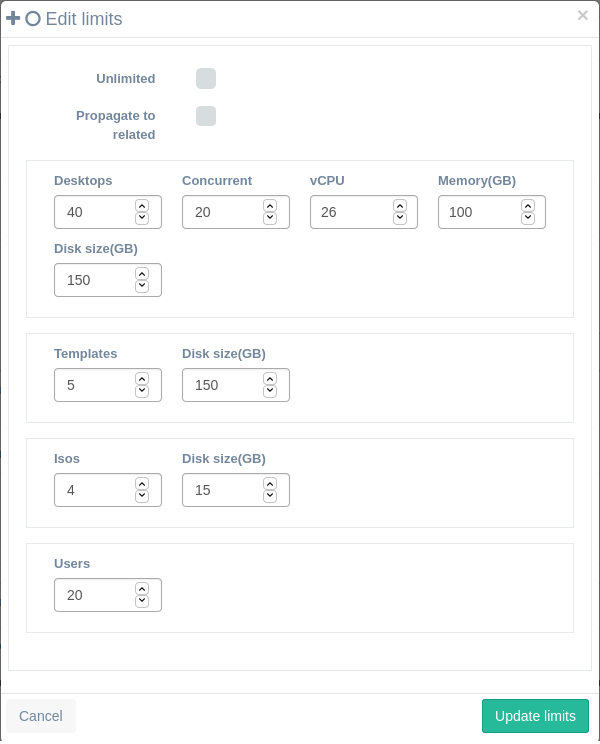

<h1>Limits</h1>

Limits will limit the maximum resources that a tenant (or company) can use from the server. The tenants will be set at the category level, so each new category will have it's own limits (or can be unlimited as the default created during install).

[TOC]

# Types of limits

There are a set of limits that can be modified. This limits apply to all the category or group absolute totals.

- **Desktops**: Maximum number of desktops that can be created in a category or group.
- **Concurrent:**: Maximum number of desktops that can run concurrently in a category or group.
- **Templates**: Maximum number of templates that can be created in a category or group.
- **Media** (or Isos): Maximum number of media isos that can be uploaded in a category or group.
- **CPUs**: Maximum number of virtual CPUs that can be used in concurrent desktops in a category or group.
- **Memory**: Maximum memory in GB that can be used in concurrent desktops in a category or group.

There are to global options, **unlimited** and **propagate to related**:

- **Unlimited**: If checked no limits will be applied at this level. Levels of limits can be applied at category, group levels.
- **Propagate to related**: When checked will override all limit definitions at lower levels.
  - If you are editing category limits it will override to this limits all groups under this category.
  - If you are editing group limits it will limit the totals for this group.

# Effective limits

It will apply the most restrictive limits between the group and the parent category (if they are enabled)

A user is always being classified within a category, group and user, in that order of hierarchical priority. This means that the effective quotas for a user will be the most restrictive from top to down.

If we do modify quota for a user individually, then that quota will override the one that had before based on role, category and group hierarchy.

- #### Group limits

  - If limited and configured: This quotas will be applied if it is not restricted by parent category limits.

  - If unlimited: Parent category limits will be checked:

    - #### Category limits

      - If limited and configured: This limits will be applied.
      - If unlimited: the category will have no restrictions in his limits.