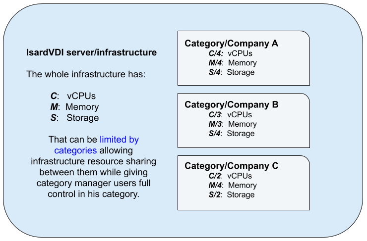

<h1>Multitenant</h1>

The quotas can limit the resources used by each role, category, group or user individually for different items.

[TOC]

# Introduction

Multi-tenant IsardVDI installation allows for multiple organizations/companies to share the same IsardVDI installation. This is, the same infrastructure now can be *split* by *limits* into a shared infrastructure, where *managers* in that organization can administer everything within the defined limits.

This allows a new level of control as categories and groups in categories can have limits stablished (users, desktops, vCPUs, ...).

# Configuration

In **users** menu administrators can manage categories that can have a **manager user** with full control over that category.

To create a new category with resource usage limits and user autoregistering (github/google) as an admin user:

- **Add new category** and set a name to it. For example we will create*ACME* category. A new *Main* group with this parent category will be also added in the groups.
- **Set category limits** by opening the category details and click in the *Limits* button.
- **Add new manager user** by clicking in the users section and be sure to set his role to *manager* and the category to **ACME** and group to **Main ACME**
- **Get autoregister OAuth codes** by opening the *Main ACME* group and clicking on **Enrollments**. There you can enable *manager*, *advanced* and *user* keys for your users. Usually you only want to distribute the *advanced* keys to the users you want to allow to create templates and the *user* keys to the users that will only be accessing to desktops.