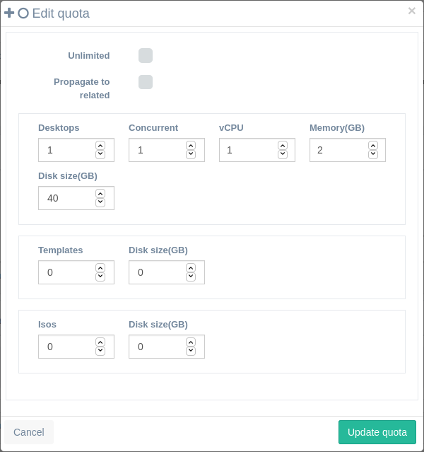

<h1>Quotas</h1>

The quotas can limit the resources used by each role, category, group or user individually for different items.

[TOC]

# Types of quotas

There are a set of quotas that can be modified:

- **Desktops**: Maximum number of desktops that a user can create. User can delete desktops and create new ones, but never have more than his desktops quota at the same time.
- **Concurrent:**: Maximum number of desktops that the user can have running concurrently at the same time.
- **Templates**: Maximum number of templates that the user can create from their desktops.
- **Media** (or Isos): Maximum number of media (isos/floppies) that the user can upload to the system.
- **CPUs**: Maximum number of virtual CPUs that can be set to a desktop.
- **Memory**: Maximum memory in GB that can set to a desktop.

There are to global options, **unlimited** and **propagate to related**:

- **Unlimited**: If checked no quotas will be applied at this level. Levels of quotas can be applied at category, group or user level.
- **Propagate to related**: When checked will override all quota definitions on lower levels.
  - If you are editing category quotas it will override to this quotas all groups and users under this category.
  - If you are editing group quotas it will override all user quotas under this group.

If you edit an individual user quota this will override others set at highr levels. See next section on effective quotas.

# Effective quotas for user

The quota hierarchy  is applied from down to up, so first it will set up the user quota if enabled. If not it will apply the user group quota if enabled. If not it will apply the category quota.

A user is always being classified within a category, group and user, in that order of hierarchical priority. This means that the effective quotas for a user will be the most restrictive from top to down.

If we do modify quota for a user individually, then that quota will override the one that had before based on role, category and group hierarchy.

- #### User quota

  - If limited and configured: This quotas will be applied.

  - if unlimited: Next higher level will be checked:

    - #### Group quotas

      - If limited and configured: This quotas will be applied.

      - If unlimited: Next high level will be checked:

        - #### Category quotas

          - If limited and configured: This quotas will be applied.
          - If unlimited: the user will have no restrictions in his quota at all.