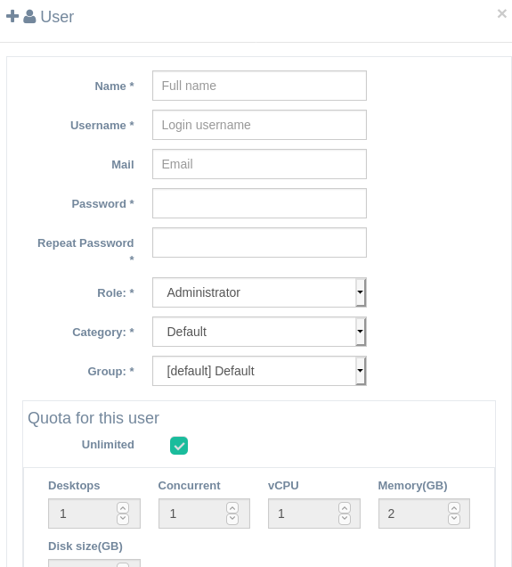
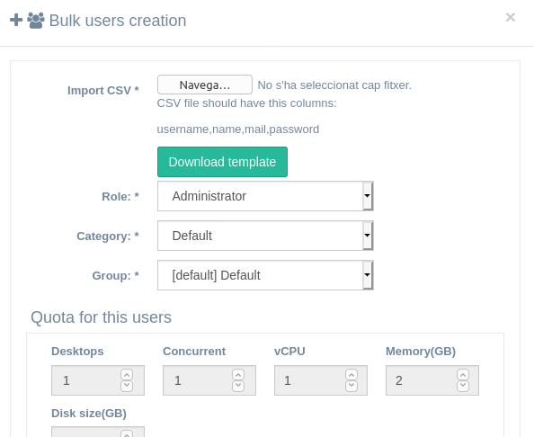

# Configuration

[TOC]

# Agrupations

There are different agrupations in users menu:

- Roles: Not configurable. They are defined internally
- Categories: Administrator roles can set up categories (used as tenants/companies)
- Groups: Administrator and Manager roles can set up groups.
- Users: Administrator and Manager roles can set up users.

# Roles

## Administrator

Users with this role have full access to everything.

## Manager

Manager users can manage all his category items (groups, users, templates, desktops, isos).

- They will only see what's inside his category and also items shared by IsardVDI administrators.
- They can't modify category limits nor quotas (those are stablished by administrators)
- They can modify their groups limits and quotas. Also their users quotas.
- Then have full control over his category:
  - Users
  - Groups
  - Desktops
  - Templates
  - Media
- They have access to usage statistics and graphs.

## Advanced

Advanced users can create templates from desktops and also upload ISO images and create desktops from those ISO.

- Can manage only their own desktops as any user.
- Can manage only their own templates.
- Can create new templates from their own desktops.
- Can apply shares to those templates, but only in their category, and category groups and users.
- Can upload ISO image files and manage their own
- Can create desktops from ISO images.

## User

Users can only create desktops from allowed templates.

- Manage their own desktops 
- Create desktops from allowed templates shared with them.

# Add user

Users can be:

- Local (database)
- Oauth2 (gitlab & google)

## Local

Local users can be added one by one or in bulk.

### One user

When adding a user you should set some parameters.

The most important things regarding to IsardVDI are:

- Role: this role will allow or restrict user access to features.
- Category: the category limits and quota will be applied if no others set at group or user level.
- Group: the group limits and quota will be applied if no others set at user level
- Quota for this user: If set, this quota will override any user group and category quotas defined. Limits can not be overriden at user level.

### Bulk users

You can massively add users. To do it  download the user template CSV file sample, modify it to your needs and upload it again.

Just before accepting the form be sure to select the correct role, category and group (and quota if applies) where those users will be created.

## Oauth2

For oauth2 user auto registering you should set Oauth2 parameters in isardvdi.conf and bring up the compose again. Please refer to [configuration](../install/install/#configuration).

# Add category

New categories can be added only by administrators. This categories can have **manager** users that will have full control over items inside (desktops, users, templates, ...). This configuration is known as [multitenant](multitenant.md).

In the category details you can set *quota* and *limits* for users in this category.

# Add group

New groups can be added by administrators or managers. Managers can only add groups within his managed category. 

In the group details you can set *quota* and *limits* for users in this group.

Also, autoregistering keys for OAuth2 can be managed from each group.

# Quotas

There are a set of quotas that can be modified:

- **Desktops**: Maximum number of desktops that a user can create. User can delete desktops and create new ones, but never have more than his desktops quota at the same time.
- **Concurrent:**: Maximum number of desktops that the user can have running concurrently at the same time.
- **Templates**: Maximum number of templates that the user can create from their desktops.
- **Media** (or Isos): Maximum number of media (isos/floppies) that the user can upload to the system.
- **CPUs**: Maximum number of virtual CPUs that can be set to a desktop.
- **Memory**: Maximum memory in GB that can set to a desktop.

There are to global options, **unlimited** and **propagate to related**:

- **Unlimited**: If checked no quotas will be applied at this level. Levels of quotas can be applied at category, group or user level.
- **Propagate to related**: When checked will override all quota definitions on lower levels.
  - If you are editing category quotas it will override to this quotas all groups and users under this category.
  - If you are editing group quotas it will override all user quotas under this group.

If you edit an individual user quota this will override others set at highr levels. See next section on effective quotas.

## Effective quotas for user

The quota hierarchy  is applied from down to up, so first it will set up the user quota if enabled. If not it will apply the user group quota if enabled. If not it will apply the category quota.

A user is always being classified within a category, group and user, in that order of hierarchical priority. This means that the effective quotas for a user will be the most restrictive from top to down.

If we do modify quota for a user individually, then that quota will override the one that had before based on role, category and group hierarchy.

- #### User quota

  - If limited and configured: This quotas will be applied.

  - if unlimited: Next higher level will be checked:

    - #### Group quotas

      - If limited and configured: This quotas will be applied.

      - If unlimited: Next high level will be checked:

        - #### Category quotas

          - If limited and configured: This quotas will be applied.
          - If unlimited: the user will have no restrictions in his quota at all.

# Limits

Limits will limit the maximum resources that a tenant (or company) can use from the server. The tenants will be set at the category level, so each new category will have it's own limits (or can be unlimited as the default created during install).

There are a set of limits that can be modified. This limits apply to all the category or group absolute totals.

- **Desktops**: Maximum number of desktops that can be created in a category or group.
- **Concurrent:**: Maximum number of desktops that can run concurrently in a category or group.
- **Templates**: Maximum number of templates that can be created in a category or group.
- **Media** (or Isos): Maximum number of media isos that can be uploaded in a category or group.
- **CPUs**: Maximum number of virtual CPUs that can be used in concurrent desktops in a category or group.
- **Memory**: Maximum memory in GB that can be used in concurrent desktops in a category or group.

There are to global options, **unlimited** and **propagate to related**:

- **Unlimited**: If checked no limits will be applied at this level. Levels of limits can be applied at category, group levels.
- **Propagate to related**: When checked will override all limit definitions at lower levels.
  - If you are editing category limits it will override to this limits all groups under this category.
  - If you are editing group limits it will limit the totals for this group.

## Effective limits

It will apply the most restrictive limits between the group and the parent category (if they are enabled)

A user is always being classified within a category, group and user, in that order of hierarchical priority. This means that the effective quotas for a user will be the most restrictive from top to down.

If we do modify quota for a user individually, then that quota will override the one that had before based on role, category and group hierarchy.

- #### Group limits

  - If limited and configured: This quotas will be applied if it is not restricted by parent category limits.

  - If unlimited: Parent category limits will be checked:

    - #### Category limits

      - If limited and configured: This limits will be applied.
      - If unlimited: the category will have no restrictions in his limits.