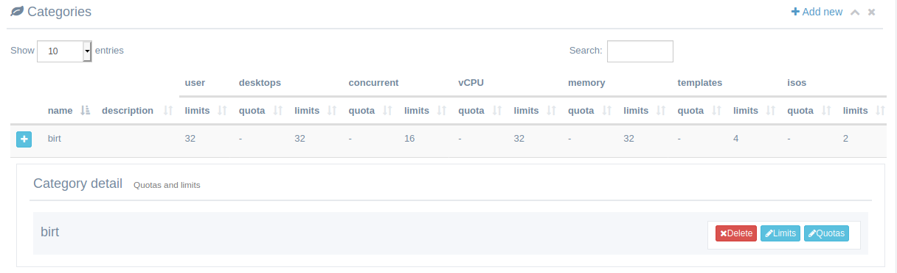
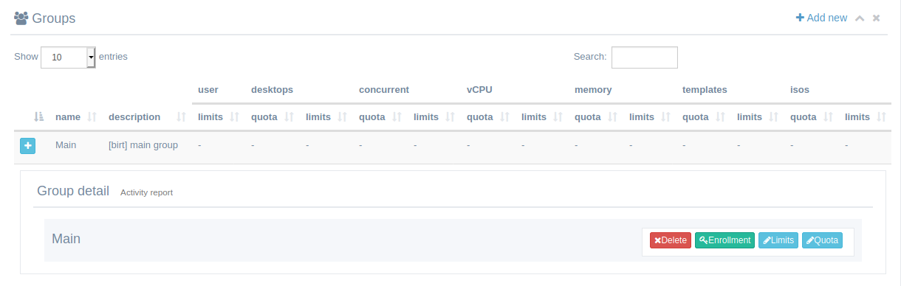
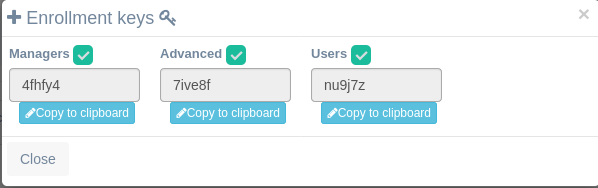

<h1>Web Interfaces</h1>

From version 2.0 there are 2 web interfaces, the '*traditional*' interface and a new *user simplified interface*. This allows advanced users and new **manager** users to administer templates and company limits and quotas while leaving a simplified interface to the users.

[TOC]

# User simplified web interface

By connecting to the URL for your installation you will access the user simplified interface. This frontend allows users to access their desktops based on templates by authenticating with:

- OAUTH2 (google, github). You should set up your google/github application auth tokens in isardvdi.conf.
- Local database users

For this interface to be ready managers or administrations must configure IsardVDI categories and groups (follow next section).

# Administration web interface

This is the traditional interface. Here any user role can log in but, to start, you should access https://*<your url>*/isard-admin with your admin credentials.

Once inside you can create a **multitenant** acces by creating as many categories as companies you want to hold in your IsardVDI installation. This will allow for user simplified web access to be used.

When you create a new category (company) it will create a default 'Main' group for that category. You can create as many groups in that category as you want.  And in groups you will find the auto registering keys for OAUTH users:

The category groups have the enrollment keys for the users. You can always create users in that category in local database by using this **users** menu, but you can also use those auto enrollment keys and distribute it to your company/school users to let them auto enroll in a group.

Groups and Categories can have absolute limits set up. Also they can have a per user quota set, that can be overriden in individual users.

And there you will be able to enable/disable role enrollment keys and generate new ones.

## Sharing templates

As the simplified user interface only allows (by now) non-persistent desktops, it will show to the user the templates he has access and it will create a non-persistent desktop ready to be used that will be destroyed on session logout.

So be sure to share (alloweds) at least one template with the user (or his group o category).