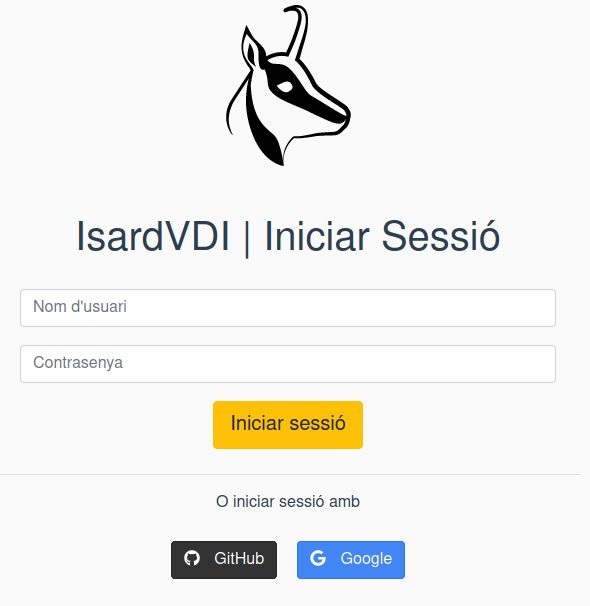
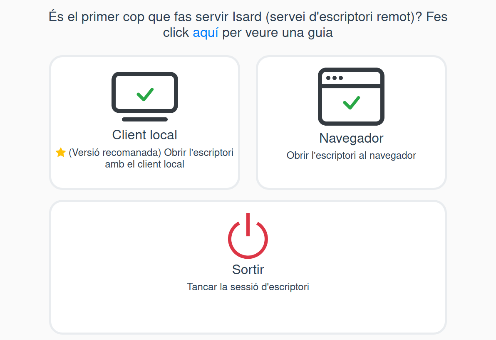
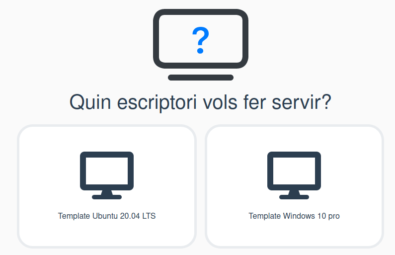
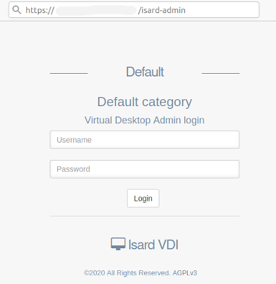
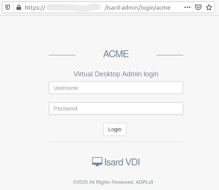

<h1>Web interfaces</h1>

From v2.X there are two interfaces that gives different access types to IsardVDI

[TOC]

# Simple user interface

This interface it is the main interface now when user access to the domain URL root. It is intended to bring a simplified user interface to access non-persistent desktops from it's user allowed templates.

This interface allows:

- Access using Oauth2 authentications
- Access to live nonpersistent desktops, destroyed on session logout.
- Multi template option

With this simple interface the user is given two kinds of of viewers:

- Local client: Using the spice client
- Browser: Using the same browser with HTML5

If the user has access to more than one non persistent desktop (he has access to more than one template) the system will ask which non persistent desktop wants to create and access on login:

# Full admin interface

Now this interface is intended for **Administrator**, **Manager** and **Advanced** roles as it brings them full control. Normal **users** can still access this admin interface if they are allowed to have persistent desktops. 

The URL for accessing this web interface for *Default* category is in **/isard-admin** if you don't create a multitenancy configuration. 

For multitenancy configurations each user should access through it's own category portal in **/isard-admin/login/[category]**.

