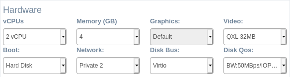
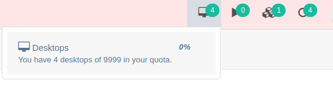

<h1>Quotas</h1>

When creating or editing desktops and templates user will have some quotas and upper limits applied. Refer to administration section for more details on how to limit/configure quotas and limits.

[TOC]

# Create/Edit

When creating or editing desktops or templates there are [quotas](../admin/quotas.md) defined that will set the maximum parameters the user can set. This quotas apply to the maximum number of:

- vCPU per desktop/template
- Memory per desktop/template

The other parameters are resources that are shared with the *allows* form by administrator users. The user can only choose between the resources that the administrator shared.

Also the user will have a maximum quota for desktops and templates that will advice him if maximum quota is reached. In this example the user has no virtual quota set.

Also the group and category limits will be checked and user advised if his group or category limits to create a desktop or template have been reached.

# Start

When starting a new desktop the user quota will be checked and also the group and category limits. If there is a limit or quota reached the user will be adviced and no operation performed.

In the start process for concurrent desktops also the vCPU and Memory limits will be checked to allow for more concurrent resource usage or forbid it.

# Media upload

The user quota for uploading new ISO image files will be checked and user advised if maximum reached. Also the group and category limits can forbid the user to upload new file.

